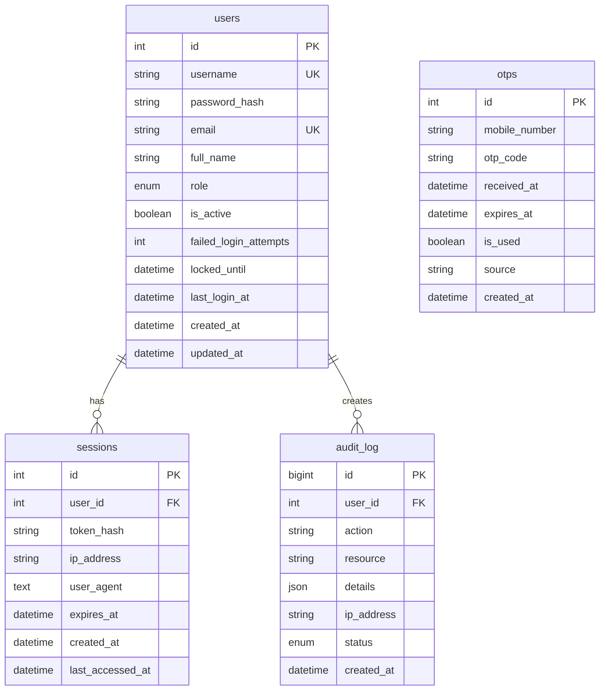
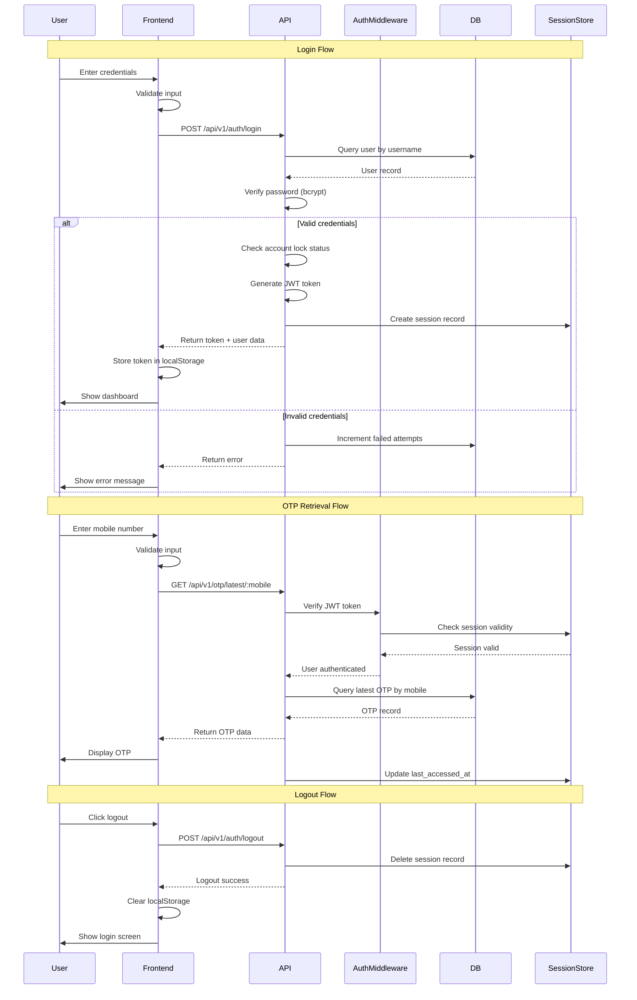
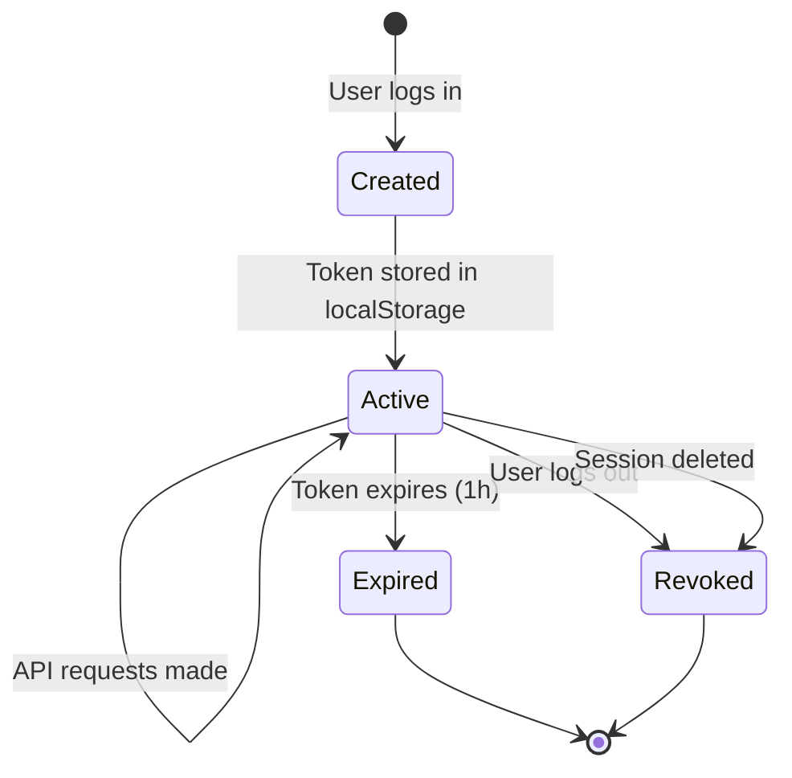

# OTP Helper Tool - Production Architecture Design

## Table of Contents

1. [Executive Summary](#executive-summary)
2. [Project Structure](#project-structure)
3. [Technology Stack](#technology-stack)
4. [Database Schema](#database-schema)
5. [API Design](#api-design)
6. [Security Considerations](#security-considerations)
7. [Frontend Architecture](#frontend-architecture)
8. [Authentication Flow](#authentication-flow)
9. [Error Handling](#error-handling)
10. [Configuration Management](#configuration-management)
11. [Deployment Considerations](#deployment-considerations)

---

## Executive Summary

This document outlines the production-ready architecture for transforming the current single-file `service.html` OTP helper tool into a properly structured web application with real MySQL authentication. The architecture separates concerns into distinct layers, implements secure authentication with password hashing, and provides a scalable foundation for future enhancements.

**Key Objectives:**
- Separate HTML, CSS, and JavaScript into distinct files
- Implement real MySQL-based authentication with bcrypt password hashing
- Replace all simulated logic with production-grade implementations
- Ensure security best practices throughout the application
- Provide a maintainable and scalable codebase

---

## Project Structure

```
otp-fetch/
├── backend/
│   ├── src/
│   │   ├── config/
│   │   │   ├── database.js          # MySQL connection configuration
│   │   │   ├── environment.js       # Environment variable loader
│   │   │   └── constants.js         # Application constants
│   │   ├── controllers/
│   │   │   ├── authController.js    # Authentication logic
│   │   │   └── otpController.js     # OTP retrieval logic
│   │   ├── middleware/
│   │   │   ├── authMiddleware.js    # JWT verification middleware
│   │   │   ├── errorHandler.js      # Global error handler
│   │   │   ├── rateLimiter.js       # Rate limiting middleware
│   │   │   └── requestLogger.js     # Request logging middleware
│   │   ├── models/
│   │   │   ├── User.js              # User model with queries
│   │   │   ├── Otp.js               # OTP model with queries
│   │   │   └── Session.js           # Session model with queries
│   │   ├── routes/
│   │   │   ├── authRoutes.js        # Authentication endpoints
│   │   │   └── otpRoutes.js         # OTP endpoints
│   │   ├── services/
│   │   │   ├── authService.js       # Authentication business logic
│   │   │   ├── otpService.js        # OTP business logic
│   │   │   └── tokenService.js      # JWT token management
│   │   ├── utils/
│   │   │   ├── logger.js            # Logging utility
│   │   │   ├── validator.js         # Input validation
│   │   │   └── response.js          # Standardized response formatter
│   │   └── app.js                   # Express application setup
│   ├── tests/
│   │   ├── unit/
│   │   │   ├── authController.test.js
│   │   │   └── otpController.test.js
│   │   └── integration/
│   │       └── api.test.js
│   ├── .env.example                 # Environment variables template
│   ├── package.json                 # Node.js dependencies
│   └── server.js                    # Application entry point
├── frontend/
│   ├── public/
│   │   ├── index.html               # Main HTML file
│   │   └── favicon.ico
│   ├── src/
│   │   ├── css/
│   │   │   ├── main.css             # Main stylesheet
│   │   │   ├── variables.css        # CSS variables
│   │   │   └── components.css      # Component-specific styles
│   │   ├── js/
│   │   │   ├── api/
│   │   │   │   ├── authApi.js       # Authentication API calls
│   │   │   │   └── otpApi.js        # OTP API calls
│   │   │   ├── services/
│   │   │   │   ├── authService.js   # Authentication service
│   │   │   │   └── otpService.js    # OTP service
│   │   │   ├── ui/
│   │   │   │   ├── toast.js         # Toast notifications
│   │   │   │   └── loading.js       # Loading states
│   │   │   ├── utils/
│   │   │   │   ├── validator.js     # Client-side validation
│   │   │   │   └── storage.js       # Local storage wrapper
│   │   │   └── app.js               # Main application entry
│   │   └── assets/
│   │       └── images/
│   └── package.json                 # Frontend dependencies
├── database/
│   ├── migrations/
│   │   ├── 001_create_users_table.sql
│   │   ├── 002_create_otps_table.sql
│   │   ├── 003_create_sessions_table.sql
│   │   └── 004_create_audit_log_table.sql
│   ├── seeds/
│   │   └── 001_seed_admin_user.sql  # Initial admin user
│   └── schema.sql                   # Complete database schema
├── docs/
│   ├── API.md                       # API documentation
│   ├── DEPLOYMENT.md                # Deployment guide
│   └── architecture.md              # This document
├── .gitignore
├── README.md
└── docker-compose.yml               # Docker setup for development
```

---

## Technology Stack

### Backend: Node.js with Express.js

**Justification:**

| Factor | Node.js/Express | Python/Flask | Go/Gin |
|--------|-----------------|--------------|--------|
| **JavaScript Ecosystem** | Native (same as frontend) | Requires separate language | Requires separate language |
| **MySQL Support** | Excellent (mysql2) | Good (SQLAlchemy) | Good (GORM) |
| **JWT Libraries** | Mature (jsonwebtoken) | Mature (PyJWT) | Mature (golang-jwt) |
| **Performance** | High (async I/O) | Good (sync/async) | Very High |
| **Learning Curve** | Low (same language as frontend) | Medium | Medium-High |
| **Community Support** | Very Large | Large | Growing |
| **Deployment** | Simple (PM2, Docker) | Simple (Gunicorn, Docker) | Simple (Docker) |

**Selected Stack: Node.js + Express.js**

**Reasons:**
1. **Unified Language**: Frontend and backend both use JavaScript, reducing context switching
2. **Mature Ecosystem**: Extensive npm packages for authentication, validation, and database operations
3. **Async/Await**: Native support for asynchronous operations, ideal for database queries
4. **MySQL Integration**: `mysql2` provides excellent performance and promise support
5. **JWT Support**: `jsonwebtoken` is battle-tested and widely adopted
6. **Scalability**: Event-driven architecture handles concurrent requests efficiently

### Backend Dependencies

```json
{
  "dependencies": {
    "express": "^4.18.2",
    "mysql2": "^3.6.0",
    "bcryptjs": "^2.4.3",
    "jsonwebtoken": "^9.0.2",
    "dotenv": "^16.3.1",
    "express-rate-limit": "^7.1.0",
    "helmet": "^7.1.0",
    "cors": "^2.8.5",
    "joi": "^17.11.0",
    "winston": "^3.11.0",
    "express-validator": "^7.0.1"
  },
  "devDependencies": {
    "nodemon": "^3.0.1",
    "jest": "^29.7.0",
    "supertest": "^6.3.3"
  }
}
```

### Frontend: Vanilla JavaScript (ES6+)

**Justification:**
- Lightweight and fast (no framework overhead)
- Direct DOM manipulation for simple UI
- Easy to maintain for this scope
- No build step required (can be served directly)

**Optional Enhancement:** Consider using Alpine.js or Vue.js for future complexity.

---

## Database Schema

### Database: `dsa`

### Table: `users`

Stores user authentication credentials and profile information.

```sql
CREATE TABLE users (
    id INT UNSIGNED AUTO_INCREMENT PRIMARY KEY,
    username VARCHAR(50) NOT NULL UNIQUE,
    password_hash VARCHAR(255) NOT NULL,
    email VARCHAR(100) UNIQUE,
    full_name VARCHAR(100),
    role ENUM('admin', 'user') DEFAULT 'user',
    is_active BOOLEAN DEFAULT TRUE,
    failed_login_attempts INT DEFAULT 0,
    locked_until DATETIME NULL,
    last_login_at DATETIME NULL,
    created_at DATETIME DEFAULT CURRENT_TIMESTAMP,
    updated_at DATETIME DEFAULT CURRENT_TIMESTAMP ON UPDATE CURRENT_TIMESTAMP,
    INDEX idx_username (username),
    INDEX idx_email (email),
    INDEX idx_is_active (is_active)
) ENGINE=InnoDB DEFAULT CHARSET=utf8mb4 COLLATE=utf8mb4_unicode_ci;
```

**Column Descriptions:**

| Column | Type | Description |
|--------|------|-------------|
| `id` | INT UNSIGNED | Primary key, auto-incrementing |
| `username` | VARCHAR(50) | Unique username for login |
| `password_hash` | VARCHAR(255) | Bcrypt hashed password (60 chars) |
| `email` | VARCHAR(100) | Optional email address |
| `full_name` | VARCHAR(100) | User's full name |
| `role` | ENUM | User role: 'admin' or 'user' |
| `is_active` | BOOLEAN | Account status flag |
| `failed_login_attempts` | INT | Counter for failed login attempts |
| `locked_until` | DATETIME | Timestamp for account lock expiration |
| `last_login_at` | DATETIME | Last successful login timestamp |
| `created_at` | DATETIME | Account creation timestamp |
| `updated_at` | DATETIME | Last update timestamp |

### Table: `otps`

Stores OTP records retrieved from the production database.

```sql
CREATE TABLE otps (
    id INT UNSIGNED AUTO_INCREMENT PRIMARY KEY,
    mobile_number VARCHAR(20) NOT NULL,
    otp_code VARCHAR(10) NOT NULL,
    received_at DATETIME NOT NULL,
    expires_at DATETIME NULL,
    is_used BOOLEAN DEFAULT FALSE,
    source VARCHAR(50) DEFAULT 'production',
    created_at DATETIME DEFAULT CURRENT_TIMESTAMP,
    INDEX idx_mobile_number (mobile_number),
    INDEX idx_received_at (received_at),
    INDEX idx_mobile_received (mobile_number, received_at DESC),
    INDEX idx_expires_at (expires_at)
) ENGINE=InnoDB DEFAULT CHARSET=utf8mb4 COLLATE=utf8mb4_unicode_ci;
```

**Column Descriptions:**

| Column | Type | Description |
|--------|------|-------------|
| `id` | INT UNSIGNED | Primary key, auto-incrementing |
| `mobile_number` | VARCHAR(20) | Mobile number associated with OTP |
| `otp_code` | VARCHAR(10) | The OTP code |
| `received_at` | DATETIME | When the OTP was received |
| `expires_at` | DATETIME | When the OTP expires (optional) |
| `is_used` | BOOLEAN | Whether the OTP has been used |
| `source` | VARCHAR(50) | Source of the OTP (e.g., 'production') |
| `created_at` | DATETIME | Record creation timestamp |

### Table: `sessions`

Stores active user sessions for JWT token management.

```sql
CREATE TABLE sessions (
    id INT UNSIGNED AUTO_INCREMENT PRIMARY KEY,
    user_id INT UNSIGNED NOT NULL,
    token_hash VARCHAR(255) NOT NULL,
    ip_address VARCHAR(45),
    user_agent TEXT,
    expires_at DATETIME NOT NULL,
    created_at DATETIME DEFAULT CURRENT_TIMESTAMP,
    last_accessed_at DATETIME DEFAULT CURRENT_TIMESTAMP ON UPDATE CURRENT_TIMESTAMP,
    FOREIGN KEY (user_id) REFERENCES users(id) ON DELETE CASCADE,
    INDEX idx_user_id (user_id),
    INDEX idx_token_hash (token_hash),
    INDEX idx_expires_at (expires_at)
) ENGINE=InnoDB DEFAULT CHARSET=utf8mb4 COLLATE=utf8mb4_unicode_ci;
```

**Column Descriptions:**

| Column | Type | Description |
|--------|------|-------------|
| `id` | INT UNSIGNED | Primary key, auto-incrementing |
| `user_id` | INT UNSIGNED | Foreign key to users table |
| `token_hash` | VARCHAR(255) | Hashed JWT token for revocation |
| `ip_address` | VARCHAR(45) | Client IP address (IPv4/IPv6) |
| `user_agent` | TEXT | Client user agent string |
| `expires_at` | DATETIME | Session expiration timestamp |
| `created_at` | DATETIME | Session creation timestamp |
| `last_accessed_at` | DATETIME | Last access timestamp |

### Table: `audit_log`

Stores audit trail for security and compliance.

```sql
CREATE TABLE audit_log (
    id BIGINT UNSIGNED AUTO_INCREMENT PRIMARY KEY,
    user_id INT UNSIGNED NULL,
    action VARCHAR(50) NOT NULL,
    resource VARCHAR(100) NULL,
    details JSON NULL,
    ip_address VARCHAR(45),
    status ENUM('success', 'failure') DEFAULT 'success',
    created_at DATETIME DEFAULT CURRENT_TIMESTAMP,
    INDEX idx_user_id (user_id),
    INDEX idx_action (action),
    INDEX idx_created_at (created_at),
    FOREIGN KEY (user_id) REFERENCES users(id) ON DELETE SET NULL
) ENGINE=InnoDB DEFAULT CHARSET=utf8mb4 COLLATE=utf8mb4_unicode_ci;
```

**Column Descriptions:**

| Column | Type | Description |
|--------|------|-------------|
| `id` | BIGINT UNSIGNED | Primary key, auto-incrementing |
| `user_id` | INT UNSIGNED | Foreign key to users table (nullable) |
| `action` | VARCHAR(50) | Action performed (e.g., 'login', 'otp_fetch') |
| `resource` | VARCHAR(100) | Resource affected (e.g., 'otp', 'session') |
| `details` | JSON | Additional details as JSON |
| `ip_address` | VARCHAR(45) | Client IP address |
| `status` | ENUM | Action status: 'success' or 'failure' |
| `created_at` | DATETIME | Log entry timestamp |

### Entity Relationship Diagram



---

## API Design

### Base URL
```
http://localhost:3000/api/v1
```

### Authentication Endpoints

#### POST `/api/v1/auth/login`

Authenticate a user and receive a JWT token.

**Request:**
```json
{
  "username": "admin",
  "password": "SecurePass123!"
}
```

**Response (Success - 200):**
```json
{
  "success": true,
  "data": {
    "token": "eyJhbGciOiJIUzI1NiIsInR5cCI6IkpXVCJ9...",
    "user": {
      "id": 1,
      "username": "admin",
      "email": "admin@example.com",
      "role": "admin"
    },
    "expiresIn": 3600
  }
}
```

**Response (Error - 401):**
```json
{
  "success": false,
  "error": {
    "code": "INVALID_CREDENTIALS",
    "message": "Invalid username or password"
  }
}
```

**Response (Error - 423):**
```json
{
  "success": false,
  "error": {
    "code": "ACCOUNT_LOCKED",
    "message": "Account is temporarily locked. Please try again later."
  }
}
```

#### POST `/api/v1/auth/logout`

Invalidate the current session.

**Headers:**
```
Authorization: Bearer <token>
```

**Response (Success - 200):**
```json
{
  "success": true,
  "message": "Logged out successfully"
}
```

#### POST `/api/v1/auth/refresh`

Refresh an expired JWT token.

**Headers:**
```
Authorization: Bearer <token>
```

**Response (Success - 200):**
```json
{
  "success": true,
  "data": {
    "token": "eyJhbGciOiJIUzI1NiIsInR5cCI6IkpXVCJ9...",
    "expiresIn": 3600
  }
}
```

#### GET `/api/v1/auth/me`

Get current user information.

**Headers:**
```
Authorization: Bearer <token>
```

**Response (Success - 200):**
```json
{
  "success": true,
  "data": {
    "id": 1,
    "username": "admin",
    "email": "admin@example.com",
    "full_name": "Administrator",
    "role": "admin",
    "last_login_at": "2024-01-15T10:30:00Z"
  }
}
```

### OTP Endpoints

#### GET `/api/v1/otp/latest/:mobileNumber`

Retrieve the latest OTP for a given mobile number.

**Headers:**
```
Authorization: Bearer <token>
```

**URL Parameters:**
| Parameter | Type | Required | Description |
|-----------|------|----------|-------------|
| `mobileNumber` | string | Yes | Mobile number to fetch OTP for |

**Response (Success - 200):**
```json
{
  "success": true,
  "data": {
    "mobile": "1234567890",
    "otp": "123456",
    "receivedAt": "2024-01-15T10:25:00Z",
    "expiresAt": "2024-01-15T10:30:00Z"
  }
}
```

**Response (Error - 404):**
```json
{
  "success": false,
  "error": {
    "code": "OTP_NOT_FOUND",
    "message": "No OTP found for the specified mobile number"
  }
}
```

**Response (Error - 400):**
```json
{
  "success": false,
  "error": {
    "code": "INVALID_MOBILE_NUMBER",
    "message": "Please enter a valid mobile number"
  }
}
```

#### GET `/api/v1/otp/history/:mobileNumber`

Retrieve OTP history for a mobile number (paginated).

**Headers:**
```
Authorization: Bearer <token>
```

**URL Parameters:**
| Parameter | Type | Required | Description |
|-----------|------|----------|-------------|
| `mobileNumber` | string | Yes | Mobile number to fetch history for |

**Query Parameters:**
| Parameter | Type | Default | Description |
|-----------|------|---------|-------------|
| `page` | integer | 1 | Page number |
| `limit` | integer | 10 | Items per page |

**Response (Success - 200):**
```json
{
  "success": true,
  "data": {
    "otps": [
      {
        "id": 1,
        "mobile": "1234567890",
        "otp": "123456",
        "receivedAt": "2024-01-15T10:25:00Z",
        "expiresAt": "2024-01-15T10:30:00Z",
        "isUsed": false
      }
    ],
    "pagination": {
      "page": 1,
      "limit": 10,
      "total": 25,
      "totalPages": 3
    }
  }
}
```

### Health Check Endpoint

#### GET `/api/v1/health`

Check API health status.

**Response (Success - 200):**
```json
{
  "success": true,
  "data": {
    "status": "healthy",
    "timestamp": "2024-01-15T10:30:00Z",
    "database": "connected"
  }
}
```

### HTTP Status Codes

| Code | Description |
|------|-------------|
| 200 | OK - Request successful |
| 201 | Created - Resource created successfully |
| 400 | Bad Request - Invalid input |
| 401 | Unauthorized - Authentication required |
| 403 | Forbidden - Insufficient permissions |
| 404 | Not Found - Resource not found |
| 422 | Unprocessable Entity - Validation error |
| 423 | Locked - Account locked |
| 429 | Too Many Requests - Rate limit exceeded |
| 500 | Internal Server Error - Server error |

---

## Security Considerations

### Password Hashing

**Algorithm:** bcrypt with 12 salt rounds

**Implementation:**
```javascript
const bcrypt = require('bcryptjs');
const SALT_ROUNDS = 12;

// Hash password
const hashPassword = async (password) => {
  return await bcrypt.hash(password, SALT_ROUNDS);
};

// Verify password
const verifyPassword = async (password, hash) => {
  return await bcrypt.compare(password, hash);
};
```

**Why bcrypt:**
- Adaptive cost factor (can be increased as hardware improves)
- Built-in salt generation
- Resistant to rainbow table attacks
- Widely adopted and battle-tested

### JWT Token Management

**Token Structure:**
```javascript
{
  "sub": "user_id",
  "username": "admin",
  "role": "admin",
  "iat": 1705314600,
  "exp": 1705318200
}
```

**Configuration:**
- **Algorithm:** HS256 (HMAC-SHA256)
- **Secret:** 256-bit random key from environment
- **Expiration:** 1 hour (access token)
- **Refresh Token:** 7 days (optional)

**Implementation:**
```javascript
const jwt = require('jsonwebtoken');

const generateToken = (user) => {
  return jwt.sign(
    {
      sub: user.id,
      username: user.username,
      role: user.role
    },
    process.env.JWT_SECRET,
    { expiresIn: '1h' }
  );
};

const verifyToken = (token) => {
  return jwt.verify(token, process.env.JWT_SECRET);
};
```

### SQL Injection Prevention

**Strategy:** Use parameterized queries with prepared statements

**Implementation:**
```javascript
// Using mysql2 with prepared statements
const getUserByUsername = async (username) => {
  const [rows] = await pool.execute(
    'SELECT * FROM users WHERE username = ?',
    [username]
  );
  return rows[0];
};
```

**Never use string concatenation:**
```javascript
// ❌ BAD - Vulnerable to SQL injection
const query = `SELECT * FROM users WHERE username = '${username}'`;

// ✅ GOOD - Parameterized query
const query = 'SELECT * FROM users WHERE username = ?';
```

### CORS Configuration

**Implementation:**
```javascript
const cors = require('cors');

app.use(cors({
  origin: process.env.FRONTEND_URL || 'http://localhost:8080',
  credentials: true,
  methods: ['GET', 'POST', 'PUT', 'DELETE'],
  allowedHeaders: ['Content-Type', 'Authorization']
}));
```

### Rate Limiting

**Strategy:** Implement rate limiting per IP address

**Implementation:**
```javascript
const rateLimit = require('express-rate-limit');

const authLimiter = rateLimit({
  windowMs: 15 * 60 * 1000, // 15 minutes
  max: 5, // 5 attempts per window
  message: {
    success: false,
    error: {
      code: 'TOO_MANY_REQUESTS',
      message: 'Too many login attempts. Please try again later.'
    }
  },
  standardHeaders: true,
  legacyHeaders: false
});

app.use('/api/v1/auth/login', authLimiter);
```

### Input Validation

**Strategy:** Use Joi for schema validation

**Implementation:**
```javascript
const Joi = require('joi');

const loginSchema = Joi.object({
  username: Joi.string()
    .alphanum()
    .min(3)
    .max(50)
    .required(),
  password: Joi.string()
    .min(8)
    .pattern(/^(?=.*[a-z])(?=.*[A-Z])(?=.*\d)(?=.*[@$!%*?&])[A-Za-z\d@$!%*?&]/)
    .required()
    .messages({
      'string.pattern.base': 'Password must contain uppercase, lowercase, number, and special character'
    })
});

const validateLogin = (req, res, next) => {
  const { error } = loginSchema.validate(req.body);
  if (error) {
    return res.status(400).json({
      success: false,
      error: {
        code: 'VALIDATION_ERROR',
        message: error.details[0].message
      }
    });
  }
  next();
};
```

### Security Headers

**Implementation using Helmet:**
```javascript
const helmet = require('helmet');

app.use(helmet({
  contentSecurityPolicy: {
    directives: {
      defaultSrc: ["'self'"],
      styleSrc: ["'self'", "'unsafe-inline'"],
      scriptSrc: ["'self'"],
      imgSrc: ["'self'", "data:"],
      connectSrc: ["'self'"]
    }
  },
  hsts: {
    maxAge: 31536000,
    includeSubDomains: true,
    preload: true
  }
}));
```

### Account Lockout Policy

**Strategy:** Lock account after 5 failed attempts for 15 minutes

**Implementation:**
```javascript
const MAX_FAILED_ATTEMPTS = 5;
const LOCKOUT_DURATION = 15 * 60 * 1000; // 15 minutes

const checkAccountLock = async (user) => {
  if (user.failed_login_attempts >= MAX_FAILED_ATTEMPTS) {
    if (user.locked_until && new Date(user.locked_until) > new Date()) {
      throw new Error('ACCOUNT_LOCKED');
    } else {
      // Lock expired, reset
      await resetFailedAttempts(user.id);
    }
  }
};

const incrementFailedAttempts = async (userId) => {
  await pool.execute(
    `UPDATE users 
     SET failed_login_attempts = failed_login_attempts + 1,
         locked_until = CASE 
           WHEN failed_login_attempts + 1 >= ? THEN DATE_ADD(NOW(), INTERVAL ? SECOND)
           ELSE NULL
         END
     WHERE id = ?`,
    [MAX_FAILED_ATTEMPTS, LOCKOUT_DURATION / 1000, userId]
  );
};

const resetFailedAttempts = async (userId) => {
  await pool.execute(
    'UPDATE users SET failed_login_attempts = 0, locked_until = NULL WHERE id = ?',
    [userId]
  );
};
```

### Session Management

**Strategy:** Store session metadata for token revocation

**Implementation:**
```javascript
const createSession = async (userId, token, req) => {
  const tokenHash = crypto.createHash('sha256').update(token).digest('hex');
  const expiresAt = new Date(Date.now() + 3600 * 1000); // 1 hour
  
  await pool.execute(
    `INSERT INTO sessions (user_id, token_hash, ip_address, user_agent, expires_at)
     VALUES (?, ?, ?, ?, ?)`,
    [userId, tokenHash, req.ip, req.get('user-agent'), expiresAt]
  );
};

const invalidateSession = async (token) => {
  const tokenHash = crypto.createHash('sha256').update(token).digest('hex');
  await pool.execute(
    'DELETE FROM sessions WHERE token_hash = ?',
    [tokenHash]
  );
};

const isSessionValid = async (token) => {
  const tokenHash = crypto.createHash('sha256').update(token).digest('hex');
  const [rows] = await pool.execute(
    'SELECT * FROM sessions WHERE token_hash = ? AND expires_at > NOW()',
    [tokenHash]
  );
  return rows.length > 0;
};
```

### Environment Variables

**Required Variables:**
```env
# Database
DB_HOST=localhost
DB_PORT=3306
DB_USER=root
DB_PASSWORD=root
DB_NAME=dsa

# JWT
JWT_SECRET=your-256-bit-secret-key-here
JWT_EXPIRES_IN=1h

# Server
PORT=3000
NODE_ENV=production

# CORS
FRONTEND_URL=http://localhost:8080

# Rate Limiting
RATE_LIMIT_WINDOW_MS=900000
RATE_LIMIT_MAX_ATTEMPTS=5
```

---

## Frontend Architecture

### File Organization

```
frontend/
├── public/
│   └── index.html           # Main HTML structure
├── src/
│   ├── css/
│   │   ├── main.css         # Main stylesheet
│   │   ├── variables.css    # CSS custom properties
│   │   └── components.css   # Component-specific styles
│   └── js/
│       ├── api/
│       │   ├── authApi.js   # Authentication API calls
│       │   └── otpApi.js    # OTP API calls
│       ├── services/
│       │   ├── authService.js   # Authentication service
│       │   └── otpService.js    # OTP service
│       ├── ui/
│       │   ├── toast.js     # Toast notifications
│       │   └── loading.js   # Loading states
│       ├── utils/
│       │   ├── validator.js # Client-side validation
│       │   └── storage.js   # Local storage wrapper
│       └── app.js           # Main application entry
```

### HTML Structure (`public/index.html`)

```html
<!DOCTYPE html>
<html lang="en">
<head>
    <meta charset="UTF-8">
    <meta name="viewport" content="width=device-width, initial-scale=1.0">
    <meta http-equiv="Content-Security-Policy" content="default-src 'self'; style-src 'self' 'unsafe-inline'; script-src 'self'; img-src 'self' data:;">
    <title>QA OTP Helper Tool</title>
    <link rel="stylesheet" href="/src/css/variables.css">
    <link rel="stylesheet" href="/src/css/main.css">
    <link rel="stylesheet" href="/src/css/components.css">
</head>
<body>
    <div class="container">
        <!-- Login View -->
        <section id="login-view" class="card">
            <header class="header">
                <svg width="48" height="48" viewBox="0 0 24 24" fill="none" stroke="currentColor" stroke-width="2" stroke-linecap="round" stroke-linejoin="round" class="header-icon">
                    <path d="M12 22s8-4 8-10V5l-8-3-8 3v7c0 6 8 10 8 10z"></path>
                </svg>
                <h1>Secure Access</h1>
                <p>Please authenticate to continue</p>
            </header>
            
            <form id="login-form">
                <div class="form-group">
                    <label for="username">Username</label>
                    <input type="text" id="username" name="username" placeholder="Enter username" autocomplete="username" required>
                </div>
                <div class="form-group">
                    <label for="password">Password</label>
                    <input type="password" id="password" name="password" placeholder="Enter password" autocomplete="current-password" required>
                </div>
                <button type="submit" class="btn btn-primary" id="login-btn">
                    <span>Login</span>
                </button>
            </form>
        </section>

        <!-- Dashboard View (OTP Tool) -->
        <section id="dashboard-view" class="card hidden">
            <header class="header">
                <h1>OTP Retriever</h1>
                <p>Fetched securely from production DB</p>
            </header>

            <div class="form-group">
                <label for="mobileNumber">Mobile Number</label>
                <input type="tel" id="mobileNumber" name="mobileNumber" placeholder="e.g. 1234567890" pattern="[0-9]*">
            </div>

            <button id="get-otp-btn" class="btn btn-primary">
                <span>Get Latest OTP</span>
            </button>

            <!-- Result Container -->
            <div id="otp-result" class="otp-display hidden">
                <div class="otp-meta">Latest OTP for <span id="result-mobile"></span></div>
                <div class="otp-value" id="otp-code">--</div>
                <div class="otp-meta" id="otp-time">Fetched just now</div>
            </div>
            
            <div class="logout-container">
                <button id="logout-btn" class="btn-link">Logout</button>
            </div>
        </section>
    </div>

    <!-- Toast Container -->
    <div id="toast-container"></div>

    <script type="module" src="/src/js/app.js"></script>
</body>
</html>
```

### CSS Architecture

**`src/css/variables.css`** - CSS Custom Properties
```css
:root {
    /* Colors */
    --primary-color: #2563eb;
    --primary-hover: #1d4ed8;
    --bg-color: #f3f4f6;
    --card-bg: #ffffff;
    --text-main: #1f2937;
    --text-secondary: #6b7280;
    --danger-color: #ef4444;
    --success-color: #10b981;
    
    /* Spacing */
    --border-radius: 8px;
    --shadow: 0 4px 6px -1px rgba(0, 0, 0, 0.1), 0 2px 4px -1px rgba(0, 0, 0, 0.06);
    
    /* Transitions */
    --transition-fast: 0.2s ease;
    --transition-normal: 0.3s ease;
}
```

**`src/css/main.css`** - Global Styles
```css
* {
    box-sizing: border-box;
    margin: 0;
    padding: 0;
    font-family: -apple-system, BlinkMacSystemFont, "Segoe UI", Roboto, Helvetica, Arial, sans-serif;
}

body {
    background-color: var(--bg-color);
    color: var(--text-main);
    display: flex;
    justify-content: center;
    align-items: center;
    min-height: 100vh;
    padding: 20px;
}

.container {
    width: 100%;
    max-width: 420px;
}

.card {
    background: var(--card-bg);
    border-radius: var(--border-radius);
    box-shadow: var(--shadow);
    padding: 2rem;
    transition: all var(--transition-normal);
}

.header {
    text-align: center;
    margin-bottom: 2rem;
}

.header h1 {
    font-size: 1.5rem;
    font-weight: 700;
    color: var(--text-main);
    margin-bottom: 0.5rem;
}

.header p {
    color: var(--text-secondary);
    font-size: 0.875rem;
}

.header-icon {
    color: var(--primary-color);
    margin-bottom: 10px;
}

.hidden {
    display: none !important;
}

@media (max-width: 480px) {
    .card {
        padding: 1.5rem;
    }
}
```

**`src/css/components.css`** - Component Styles
```css
/* Form Elements */
.form-group {
    margin-bottom: 1.5rem;
    position: relative;
}

label {
    display: block;
    margin-bottom: 0.5rem;
    font-size: 0.875rem;
    font-weight: 500;
    color: var(--text-main);
}

input {
    width: 100%;
    padding: 0.75rem 1rem;
    border: 1px solid #d1d5db;
    border-radius: var(--border-radius);
    font-size: 1rem;
    transition: border-color var(--transition-fast), box-shadow var(--transition-fast);
}

input:focus {
    outline: none;
    border-color: var(--primary-color);
    box-shadow: 0 0 0 3px rgba(37, 99, 235, 0.1);
}

input:disabled {
    background-color: #f9fafb;
    color: #9ca3af;
    cursor: not-allowed;
}

/* Buttons */
.btn {
    width: 100%;
    padding: 0.75rem;
    border: none;
    border-radius: var(--border-radius);
    font-size: 1rem;
    font-weight: 600;
    cursor: pointer;
    transition: background-color var(--transition-fast), transform 0.1s;
    display: flex;
    justify-content: center;
    align-items: center;
    gap: 0.5rem;
}

.btn-primary {
    background-color: var(--primary-color);
    color: white;
}

.btn-primary:hover {
    background-color: var(--primary-hover);
}

.btn-primary:active {
    transform: scale(0.98);
}

.btn:disabled {
    opacity: 0.7;
    cursor: wait;
}

.btn-link {
    background: none;
    border: none;
    color: var(--text-secondary);
    text-decoration: underline;
    cursor: pointer;
    font-size: 0.875rem;
}

.logout-container {
    margin-top: 1.5rem;
    text-align: center;
}

/* OTP Display */
.otp-display {
    margin-top: 1.5rem;
    padding: 1rem;
    background-color: #f0fdf4;
    border: 1px solid #bbf7d0;
    border-radius: var(--border-radius);
    text-align: center;
    animation: fadeIn 0.4s ease-out;
}

.otp-value {
    font-size: 1.5rem;
    font-weight: 800;
    color: var(--success-color);
    letter-spacing: 2px;
    font-family: monospace;
    margin: 0.5rem 0;
    word-break: break-all;
}

.otp-meta {
    font-size: 0.75rem;
    color: var(--text-secondary);
}

/* Spinner */
.spinner {
    width: 20px;
    height: 20px;
    border: 2px solid #ffffff;
    border-top: 2px solid transparent;
    border-radius: 50%;
    animation: spin 1s linear infinite;
}

/* Toast Notifications */
#toast-container {
    position: fixed;
    top: 20px;
    right: 20px;
    z-index: 9999;
}

.toast {
    background: white;
    padding: 1rem 1.5rem;
    border-radius: var(--border-radius);
    box-shadow: var(--shadow);
    margin-bottom: 10px;
    display: flex;
    align-items: center;
    gap: 10px;
    animation: slideIn 0.3s ease-out;
    max-width: 300px;
    border-left: 4px solid var(--primary-color);
}

.toast.error { border-left-color: var(--danger-color); }
.toast.success { border-left-color: var(--success-color); }

.toast-content {
    font-size: 0.875rem;
    color: var(--text-main);
}

/* Animations */
@keyframes spin {
    0% { transform: rotate(0deg); }
    100% { transform: rotate(360deg); }
}

@keyframes fadeIn {
    from { opacity: 0; transform: translateY(-10px); }
    to { opacity: 1; transform: translateY(0); }
}

@keyframes slideIn {
    from { transform: translateX(100%); opacity: 0; }
    to { transform: translateX(0); opacity: 1; }
}
```

### JavaScript Architecture

**`src/js/api/authApi.js`** - Authentication API Calls
```javascript
const API_BASE_URL = '/api/v1';

export const authApi = {
    async login(username, password) {
        const response = await fetch(`${API_BASE_URL}/auth/login`, {
            method: 'POST',
            headers: {
                'Content-Type': 'application/json'
            },
            body: JSON.stringify({ username, password })
        });
        
        if (!response.ok) {
            const error = await response.json();
            throw new Error(error.error?.message || 'Login failed');
        }
        
        return response.json();
    },
    
    async logout(token) {
        const response = await fetch(`${API_BASE_URL}/auth/logout`, {
            method: 'POST',
            headers: {
                'Authorization': `Bearer ${token}`
            }
        });
        
        if (!response.ok) {
            const error = await response.json();
            throw new Error(error.error?.message || 'Logout failed');
        }
        
        return response.json();
    },
    
    async getMe(token) {
        const response = await fetch(`${API_BASE_URL}/auth/me`, {
            method: 'GET',
            headers: {
                'Authorization': `Bearer ${token}`
            }
        });
        
        if (!response.ok) {
            const error = await response.json();
            throw new Error(error.error?.message || 'Failed to fetch user');
        }
        
        return response.json();
    }
};
```

**`src/js/api/otpApi.js`** - OTP API Calls
```javascript
const API_BASE_URL = '/api/v1';

export const otpApi = {
    async getLatestOtp(mobileNumber, token) {
        const response = await fetch(`${API_BASE_URL}/otp/latest/${encodeURIComponent(mobileNumber)}`, {
            method: 'GET',
            headers: {
                'Authorization': `Bearer ${token}`
            }
        });
        
        if (!response.ok) {
            const error = await response.json();
            throw new Error(error.error?.message || 'Failed to fetch OTP');
        }
        
        return response.json();
    },
    
    async getOtpHistory(mobileNumber, token, page = 1, limit = 10) {
        const response = await fetch(
            `${API_BASE_URL}/otp/history/${encodeURIComponent(mobileNumber)}?page=${page}&limit=${limit}`,
            {
                method: 'GET',
                headers: {
                    'Authorization': `Bearer ${token}`
                }
            }
        );
        
        if (!response.ok) {
            const error = await response.json();
            throw new Error(error.error?.message || 'Failed to fetch OTP history');
        }
        
        return response.json();
    }
};
```

**`src/js/services/authService.js`** - Authentication Service
```javascript
import { authApi } from '../api/authApi.js';
import { storage } from '../utils/storage.js';

const TOKEN_KEY = 'auth_token';
const USER_KEY = 'auth_user';

export const authService = {
    isAuthenticated() {
        return !!storage.get(TOKEN_KEY);
    },
    
    getToken() {
        return storage.get(TOKEN_KEY);
    },
    
    getUser() {
        return storage.get(USER_KEY);
    },
    
    async login(username, password) {
        const result = await authApi.login(username, password);
        
        if (result.success) {
            storage.set(TOKEN_KEY, result.data.token);
            storage.set(USER_KEY, result.data.user);
            return result.data;
        }
        
        throw new Error('Login failed');
    },
    
    async logout() {
        const token = this.getToken();
        if (token) {
            try {
                await authApi.logout(token);
            } catch (error) {
                console.error('Logout API call failed:', error);
            }
        }
        
        storage.remove(TOKEN_KEY);
        storage.remove(USER_KEY);
    },
    
    async refreshUser() {
        const token = this.getToken();
        if (!token) {
            throw new Error('No token found');
        }
        
        const result = await authApi.getMe(token);
        if (result.success) {
            storage.set(USER_KEY, result.data);
            return result.data;
        }
        
        throw new Error('Failed to refresh user');
    }
};
```

**`src/js/services/otpService.js`** - OTP Service
```javascript
import { otpApi } from '../api/otpApi.js';
import { authService } from './authService.js';

export const otpService = {
    async getLatestOtp(mobileNumber) {
        if (!authService.isAuthenticated()) {
            throw new Error('Unauthorized access');
        }
        
        const token = authService.getToken();
        const result = await otpApi.getLatestOtp(mobileNumber, token);
        
        if (result.success) {
            return result.data;
        }
        
        throw new Error('Failed to fetch OTP');
    },
    
    async getOtpHistory(mobileNumber, page = 1, limit = 10) {
        if (!authService.isAuthenticated()) {
            throw new Error('Unauthorized access');
        }
        
        const token = authService.getToken();
        const result = await otpApi.getOtpHistory(mobileNumber, token, page, limit);
        
        if (result.success) {
            return result.data;
        }
        
        throw new Error('Failed to fetch OTP history');
    }
};
```

**`src/js/ui/toast.js`** - Toast Notifications
```javascript
export const toast = {
    show(message, type = 'info') {
        const container = document.getElementById('toast-container');
        const toastEl = document.createElement('div');
        toastEl.className = `toast ${type}`;
        
        let iconSvg = '';
        if (type === 'success') {
            iconSvg = `<svg width="20" height="20" viewBox="0 0 24 24" fill="none" stroke="#10b981" stroke-width="2" stroke-linecap="round" stroke-linejoin="round"><polyline points="20 6 9 17 4 12"></polyline></svg>`;
        } else if (type === 'error') {
            iconSvg = `<svg width="20" height="20" viewBox="0 0 24 24" fill="none" stroke="#ef4444" stroke-width="2" stroke-linecap="round" stroke-linejoin="round"><circle cx="12" cy="12" r="10"></circle><line x1="12" y1="8" x2="12" y2="12"></line><line x1="12" y1="16" x2="12.01" y2="16"></line></svg>`;
        } else {
            iconSvg = `<svg width="20" height="20" viewBox="0 0 24 24" fill="none" stroke="#2563eb" stroke-width="2" stroke-linecap="round" stroke-linejoin="round"><circle cx="12" cy="12" r="10"></circle><line x1="12" y1="16" x2="12" y2="12"></line><line x1="12" y1="8" x2="12.01" y2="8"></line></svg>`;
        }
        
        toastEl.innerHTML = `
            ${iconSvg}
            <div class="toast-content">${message}</div>
        `;
        
        container.appendChild(toastEl);
        
        // Auto-remove after 3 seconds
        setTimeout(() => {
            toastEl.style.animation = 'slideIn 0.3s ease-out reverse';
            setTimeout(() => toastEl.remove(), 300);
        }, 3000);
    },
    
    success(message) {
        this.show(message, 'success');
    },
    
    error(message) {
        this.show(message, 'error');
    },
    
    info(message) {
        this.show(message, 'info');
    }
};
```

**`src/js/ui/loading.js`** - Loading States
```javascript
export const loading = {
    set(btnElement, isLoading, text) {
        if (isLoading) {
            btnElement.disabled = true;
            const spinner = document.createElement('div');
            spinner.className = 'spinner';
            btnElement.innerHTML = '';
            btnElement.appendChild(spinner);
            const span = document.createElement('span');
            span.textContent = text;
            btnElement.appendChild(span);
        } else {
            btnElement.disabled = false;
            btnElement.textContent = text;
        }
    }
};
```

**`src/js/utils/validator.js`** - Client-side Validation
```javascript
export const validator = {
    username(value) {
        if (!value || value.length < 3) {
            return { valid: false, message: 'Username must be at least 3 characters' };
        }
        if (value.length > 50) {
            return { valid: false, message: 'Username must be less than 50 characters' };
        }
        if (!/^[a-zA-Z0-9_]+$/.test(value)) {
            return { valid: false, message: 'Username can only contain letters, numbers, and underscores' };
        }
        return { valid: true };
    },
    
    password(value) {
        if (!value || value.length < 8) {
            return { valid: false, message: 'Password must be at least 8 characters' };
        }
        if (!/(?=.*[a-z])/.test(value)) {
            return { valid: false, message: 'Password must contain at least one lowercase letter' };
        }
        if (!/(?=.*[A-Z])/.test(value)) {
            return { valid: false, message: 'Password must contain at least one uppercase letter' };
        }
        if (!/(?=.*\d)/.test(value)) {
            return { valid: false, message: 'Password must contain at least one number' };
        }
        if (!/(?=.*[@$!%*?&])/.test(value)) {
            return { valid: false, message: 'Password must contain at least one special character' };
        }
        return { valid: true };
    },
    
    mobileNumber(value) {
        if (!value) {
            return { valid: false, message: 'Mobile number is required' };
        }
        if (!/^\d{5,15}$/.test(value)) {
            return { valid: false, message: 'Please enter a valid mobile number (5-15 digits)' };
        }
        return { valid: true };
    }
};
```

**`src/js/utils/storage.js`** - Local Storage Wrapper
```javascript
export const storage = {
    get(key) {
        try {
            const item = localStorage.getItem(key);
            return item ? JSON.parse(item) : null;
        } catch (error) {
            console.error('Error reading from storage:', error);
            return null;
        }
    },
    
    set(key, value) {
        try {
            localStorage.setItem(key, JSON.stringify(value));
        } catch (error) {
            console.error('Error writing to storage:', error);
        }
    },
    
    remove(key) {
        try {
            localStorage.removeItem(key);
        } catch (error) {
            console.error('Error removing from storage:', error);
        }
    },
    
    clear() {
        try {
            localStorage.clear();
        } catch (error) {
            console.error('Error clearing storage:', error);
        }
    }
};
```

**`src/js/app.js`** - Main Application Entry
```javascript
import { authService } from './services/authService.js';
import { otpService } from './services/otpService.js';
import { toast } from './ui/toast.js';
import { loading } from './ui/loading.js';
import { validator } from './utils/validator.js';

document.addEventListener('DOMContentLoaded', () => {
    // DOM Elements
    const loginView = document.getElementById('login-view');
    const dashboardView = document.getElementById('dashboard-view');
    const loginForm = document.getElementById('login-form');
    const loginBtn = document.getElementById('login-btn');
    const mobileInput = document.getElementById('mobileNumber');
    const getOtpBtn = document.getElementById('get-otp-btn');
    const logoutBtn = document.getElementById('logout-btn');
    const otpResult = document.getElementById('otp-result');
    const resultMobile = document.getElementById('result-mobile');
    const otpCodeEl = document.getElementById('otp-code');
    const otpTimeEl = document.getElementById('otp-time');

    // Check session on load
    if (authService.isAuthenticated()) {
        switchView('dashboard');
    }

    // Event Listeners
    loginForm.addEventListener('submit', handleLogin);
    getOtpBtn.addEventListener('click', handleGetOtp);
    logoutBtn.addEventListener('click', handleLogout);

    // Handlers
    async function handleLogin(e) {
        e.preventDefault();
        const username = loginForm.username.value;
        const password = loginForm.password.value;

        // Client-side validation
        const usernameValidation = validator.username(username);
        if (!usernameValidation.valid) {
            toast.error(usernameValidation.message);
            return;
        }

        const passwordValidation = validator.password(password);
        if (!passwordValidation.valid) {
            toast.error(passwordValidation.message);
            return;
        }

        loading.set(loginBtn, true, 'Authenticating...');

        try {
            await authService.login(username, password);
            toast.success('Login successful');
            switchView('dashboard');
            loginForm.reset();
        } catch (error) {
            toast.error(error.message || 'Login failed');
        } finally {
            loading.set(loginBtn, false, 'Login');
        }
    }

    async function handleGetOtp() {
        const mobile = mobileInput.value.trim();

        // Reset previous results
        otpResult.classList.add('hidden');

        const mobileValidation = validator.mobileNumber(mobile);
        if (!mobileValidation.valid) {
            toast.error(mobileValidation.message);
            mobileInput.focus();
            return;
        }

        loading.set(getOtpBtn, true, 'Fetching from DB...');

        try {
            const data = await otpService.getLatestOtp(mobile);

            // Update UI with results
            resultMobile.textContent = data.mobile;
            otpCodeEl.textContent = data.otp;
            otpTimeEl.textContent = `Received at ${new Date(data.receivedAt).toLocaleTimeString()}`;

            otpResult.classList.remove('hidden');
            toast.success('OTP fetched successfully');
        } catch (error) {
            toast.error(error.message || 'Failed to fetch OTP');
        } finally {
            loading.set(getOtpBtn, false, 'Get Latest OTP');
        }
    }

    async function handleLogout() {
        try {
            await authService.logout();
            toast.success('Logged out securely');
            switchView('login');
            mobileInput.value = '';
            otpResult.classList.add('hidden');
        } catch (error) {
            toast.error(error.message || 'Logout failed');
        }
    }

    // Helper Functions
    function switchView(viewName) {
        if (viewName === 'dashboard') {
            loginView.classList.add('hidden');
            dashboardView.classList.remove('hidden');
        } else {
            dashboardView.classList.add('hidden');
            loginView.classList.remove('hidden');
        }
    }
});
```

---

## Authentication Flow

### Sequence Diagram



### Detailed Flow Description

#### 1. Login Flow

1. **User Input**: User enters username and password in the login form
2. **Client Validation**: Frontend validates input format (username length, password complexity)
3. **API Request**: Frontend sends POST request to `/api/v1/auth/login`
4. **Rate Limit Check**: API checks if IP has exceeded rate limit (5 attempts per 15 minutes)
5. **User Lookup**: Database queries for user by username
6. **Account Lock Check**: API checks if account is locked (5 failed attempts)
7. **Password Verification**: bcrypt.compare() verifies password against stored hash
8. **Session Creation**: On success, create session record with token hash
9. **Token Generation**: JWT token generated with user claims
10. **Audit Log**: Login attempt logged to audit_log table
11. **Response**: Token and user data returned to frontend
12. **Token Storage**: Frontend stores token in localStorage
13. **UI Update**: Dashboard view displayed

#### 2. OTP Retrieval Flow

1. **User Input**: User enters mobile number
2. **Client Validation**: Frontend validates mobile number format
3. **API Request**: Frontend sends GET request to `/api/v1/otp/latest/:mobile`
4. **Token Extraction**: Authorization header parsed for Bearer token
5. **Token Verification**: JWT signature and expiration verified
6. **Session Validation**: Session record checked in database
7. **Permission Check**: User role verified (admin/user)
8. **OTP Query**: Database queries for latest OTP by mobile number
9. **Response**: OTP data returned to frontend
10. **Session Update**: Session's last_accessed_at timestamp updated
11. **Audit Log**: OTP fetch logged to audit_log table
12. **UI Update**: OTP displayed to user

#### 3. Logout Flow

1. **User Action**: User clicks logout button
2. **API Request**: Frontend sends POST request to `/api/v1/auth/logout`
3. **Token Verification**: JWT token verified
4. **Session Deletion**: Session record deleted from database
5. **Audit Log**: Logout logged to audit_log table
6. **Response**: Success response sent to frontend
7. **Token Clear**: Frontend removes token from localStorage
8. **UI Update**: Login view displayed

### Token Lifecycle



---

## Error Handling

### Backend Error Handling Strategy

#### Error Categories

1. **Validation Errors (400)**
   - Invalid input format
   - Missing required fields
   - Constraint violations

2. **Authentication Errors (401)**
   - Invalid credentials
   - Missing or invalid token
   - Token expired

3. **Authorization Errors (403)**
   - Insufficient permissions
   - Resource access denied

4. **Not Found Errors (404)**
   - Resource not found
   - Invalid endpoint

5. **Rate Limit Errors (429)**
   - Too many requests
   - Account locked

6. **Server Errors (500)**
   - Database connection errors
   - Unexpected exceptions

#### Error Response Format

```json
{
  "success": false,
  "error": {
    "code": "ERROR_CODE",
    "message": "Human-readable error message",
    "details": {
      "field": "Additional error details"
    }
  }
}
```

#### Error Codes Reference

| Code | HTTP Status | Description |
|------|-------------|-------------|
| `VALIDATION_ERROR` | 400 | Input validation failed |
| `INVALID_CREDENTIALS` | 401 | Username or password incorrect |
| `TOKEN_MISSING` | 401 | Authorization header missing |
| `TOKEN_INVALID` | 401 | Token signature invalid |
| `TOKEN_EXPIRED` | 401 | Token has expired |
| `ACCOUNT_LOCKED` | 423 | Account temporarily locked |
| `UNAUTHORIZED` | 401 | User not authenticated |
| `FORBIDDEN` | 403 | Insufficient permissions |
| `OTP_NOT_FOUND` | 404 | No OTP found for mobile number |
| `INVALID_MOBILE_NUMBER` | 400 | Invalid mobile number format |
| `TOO_MANY_REQUESTS` | 429 | Rate limit exceeded |
| `DATABASE_ERROR` | 500 | Database operation failed |
| `INTERNAL_ERROR` | 500 | Unexpected server error |

#### Global Error Handler Implementation

```javascript
// backend/src/middleware/errorHandler.js

const errorHandler = (err, req, res, next) => {
  // Log error
  console.error('Error:', err);

  // Default error
  let error = {
    code: 'INTERNAL_ERROR',
    message: 'An unexpected error occurred',
    status: 500
  };

  // Handle specific error types
  if (err.name === 'ValidationError') {
    error = {
      code: 'VALIDATION_ERROR',
      message: err.message,
      status: 400,
      details: err.details
    };
  } else if (err.name === 'UnauthorizedError') {
    error = {
      code: 'TOKEN_INVALID',
      message: 'Invalid or expired token',
      status: 401
    };
  } else if (err.code === 'ACCOUNT_LOCKED') {
    error = {
      code: 'ACCOUNT_LOCKED',
      message: 'Account is temporarily locked. Please try again later.',
      status: 423
    };
  } else if (err.code === 'OTP_NOT_FOUND') {
    error = {
      code: 'OTP_NOT_FOUND',
      message: 'No OTP found for the specified mobile number',
      status: 404
    };
  }

  // Send error response
  res.status(error.status).json({
    success: false,
    error: {
      code: error.code,
      message: error.message,
      ...(error.details && { details: error.details })
    }
  });
};

module.exports = errorHandler;
```

### Frontend Error Handling Strategy

#### Error Handling Pattern

```javascript
// Generic API call wrapper
async function apiCall(apiFunction, ...args) {
  try {
    const result = await apiFunction(...args);
    return result;
  } catch (error) {
    // Handle specific error codes
    if (error.message.includes('TOKEN_EXPIRED') || error.message.includes('TOKEN_INVALID')) {
      // Clear invalid token and redirect to login
      authService.logout();
      toast.error('Session expired. Please login again.');
      switchView('login');
      return null;
    }
    
    if (error.message.includes('ACCOUNT_LOCKED')) {
      toast.error('Account temporarily locked. Please try again later.');
      return null;
    }
    
    if (error.message.includes('TOO_MANY_REQUESTS')) {
      toast.error('Too many attempts. Please wait before trying again.');
      return null;
    }
    
    // Generic error handling
    toast.error(error.message || 'An error occurred');
    return null;
  }
}
```

#### Error Boundary Pattern

```javascript
// Wrap async operations with error handling
async function handleLogin(e) {
  e.preventDefault();
  
  loading.set(loginBtn, true, 'Authenticating...');
  
  const result = await apiCall(
    authService.login,
    username,
    password
  );
  
  loading.set(loginBtn, false, 'Login');
  
  if (result) {
    toast.success('Login successful');
    switchView('dashboard');
  }
}
```

### Logging Strategy

#### Backend Logging (Winston)

```javascript
// backend/src/utils/logger.js

const winston = require('winston');

const logger = winston.createLogger({
  level: process.env.LOG_LEVEL || 'info',
  format: winston.format.combine(
    winston.format.timestamp(),
    winston.format.errors({ stack: true }),
    winston.format.json()
  ),
  transports: [
    new winston.transports.File({ filename: 'logs/error.log', level: 'error' }),
    new winston.transports.File({ filename: 'logs/combined.log' })
  ]
});

if (process.env.NODE_ENV !== 'production') {
  logger.add(new winston.transports.Console({
    format: winston.format.simple()
  }));
}

module.exports = logger;
```

#### Audit Logging

```javascript
// Log all authentication and OTP operations
async function logAudit(userId, action, resource, details, ipAddress, status) {
  await pool.execute(
    `INSERT INTO audit_log (user_id, action, resource, details, ip_address, status)
     VALUES (?, ?, ?, ?, ?, ?)`,
    [userId, action, resource, JSON.stringify(details), ipAddress, status]
  );
}
```

---

## Configuration Management

### Environment Variables

#### `.env.example`

```env
# Application
NODE_ENV=development
PORT=3000
LOG_LEVEL=info

# Database
DB_HOST=localhost
DB_PORT=3306
DB_USER=root
DB_PASSWORD=root
DB_NAME=dsa
DB_CONNECTION_LIMIT=10

# JWT
JWT_SECRET=your-256-bit-secret-key-change-this-in-production
JWT_EXPIRES_IN=1h
JWT_REFRESH_EXPIRES_IN=7d

# CORS
FRONTEND_URL=http://localhost:8080

# Rate Limiting
RATE_LIMIT_WINDOW_MS=900000
RATE_LIMIT_MAX_ATTEMPTS=5

# Security
BCRYPT_SALT_ROUNDS=12
MAX_FAILED_ATTEMPTS=5
LOCKOUT_DURATION_MS=900000

# Session
SESSION_EXPIRY_MS=3600000
```

### Configuration Module

```javascript
// backend/src/config/environment.js

require('dotenv').config();

const config = {
  app: {
    env: process.env.NODE_ENV || 'development',
    port: parseInt(process.env.PORT, 10) || 3000,
    logLevel: process.env.LOG_LEVEL || 'info'
  },
  database: {
    host: process.env.DB_HOST || 'localhost',
    port: parseInt(process.env.DB_PORT, 10) || 3306,
    user: process.env.DB_USER || 'root',
    password: process.env.DB_PASSWORD || '',
    database: process.env.DB_NAME || 'dsa',
    connectionLimit: parseInt(process.env.DB_CONNECTION_LIMIT, 10) || 10
  },
  jwt: {
    secret: process.env.JWT_SECRET || 'default-secret-change-me',
    expiresIn: process.env.JWT_EXPIRES_IN || '1h',
    refreshExpiresIn: process.env.JWT_REFRESH_EXPIRES_IN || '7d'
  },
  cors: {
    origin: process.env.FRONTEND_URL || 'http://localhost:8080'
  },
  rateLimit: {
    windowMs: parseInt(process.env.RATE_LIMIT_WINDOW_MS, 10) || 900000,
    maxAttempts: parseInt(process.env.RATE_LIMIT_MAX_ATTEMPTS, 10) || 5
  },
  security: {
    bcryptSaltRounds: parseInt(process.env.BCRYPT_SALT_ROUNDS, 10) || 12,
    maxFailedAttempts: parseInt(process.env.MAX_FAILED_ATTEMPTS, 10) || 5,
    lockoutDuration: parseInt(process.env.LOCKOUT_DURATION_MS, 10) || 900000
  },
  session: {
    expiryMs: parseInt(process.env.SESSION_EXPIRY_MS, 10) || 3600000
  }
};

// Validate required configuration
function validateConfig() {
  const required = ['JWT_SECRET', 'DB_PASSWORD'];
  const missing = required.filter(key => !process.env[key]);
  
  if (missing.length > 0) {
    throw new Error(`Missing required environment variables: ${missing.join(', ')}`);
  }
  
  if (config.app.env === 'production' && config.jwt.secret === 'default-secret-change-me') {
    throw new Error('JWT_SECRET must be changed in production');
  }
}

validateConfig();

module.exports = config;
```

### Database Configuration

```javascript
// backend/src/config/database.js

const mysql = require('mysql2/promise');
const config = require('./environment');
const logger = require('../utils/logger');

const pool = mysql.createPool({
  host: config.database.host,
  port: config.database.port,
  user: config.database.user,
  password: config.database.password,
  database: config.database.database,
  waitForConnections: true,
  connectionLimit: config.database.connectionLimit,
  queueLimit: 0,
  ssl: process.env.NODE_ENV === 'production' ? {} : false
});

// Test connection
pool.getConnection()
  .then(connection => {
    logger.info('Database connected successfully');
    connection.release();
  })
  .catch(error => {
    logger.error('Database connection failed:', error);
    throw error;
  });

module.exports = pool;
```

### Constants Module

```javascript
// backend/src/config/constants.js

module.exports = {
  // User roles
  ROLES: {
    ADMIN: 'admin',
    USER: 'user'
  },
  
  // Audit actions
  AUDIT_ACTIONS: {
    LOGIN: 'login',
    LOGOUT: 'logout',
    OTP_FETCH: 'otp_fetch',
    TOKEN_REFRESH: 'token_refresh'
  },
  
  // Error codes
  ERROR_CODES: {
    VALIDATION_ERROR: 'VALIDATION_ERROR',
    INVALID_CREDENTIALS: 'INVALID_CREDENTIALS',
    TOKEN_MISSING: 'TOKEN_MISSING',
    TOKEN_INVALID: 'TOKEN_INVALID',
    TOKEN_EXPIRED: 'TOKEN_EXPIRED',
    ACCOUNT_LOCKED: 'ACCOUNT_LOCKED',
    UNAUTHORIZED: 'UNAUTHORIZED',
    FORBIDDEN: 'FORBIDDEN',
    OTP_NOT_FOUND: 'OTP_NOT_FOUND',
    INVALID_MOBILE_NUMBER: 'INVALID_MOBILE_NUMBER',
    TOO_MANY_REQUESTS: 'TOO_MANY_REQUESTS',
    DATABASE_ERROR: 'DATABASE_ERROR',
    INTERNAL_ERROR: 'INTERNAL_ERROR'
  },
  
  // HTTP status codes
  HTTP_STATUS: {
    OK: 200,
    CREATED: 201,
    BAD_REQUEST: 400,
    UNAUTHORIZED: 401,
    FORBIDDEN: 403,
    NOT_FOUND: 404,
    UNPROCESSABLE_ENTITY: 422,
    LOCKED: 423,
    TOO_MANY_REQUESTS: 429,
    INTERNAL_SERVER_ERROR: 500
  }
};
```

---

## Deployment Considerations

### Development Environment

**Docker Compose Setup:**

```yaml
# docker-compose.yml
version: '3.8'

services:
  mysql:
    image: mysql:8.0
    container_name: otp-mysql
    environment:
      MYSQL_ROOT_PASSWORD: root
      MYSQL_DATABASE: dsa
    ports:
      - "3306:3306"
    volumes:
      - mysql-data:/var/lib/mysql
      - ./database/migrations:/docker-entrypoint-initdb.d
    command: --ssl-mode=DISABLED

  backend:
    build: ./backend
    container_name: otp-backend
    ports:
      - "3000:3000"
    environment:
      NODE_ENV: development
      DB_HOST: mysql
      DB_PORT: 3306
      DB_USER: root
      DB_PASSWORD: root
      DB_NAME: dsa
      JWT_SECRET: dev-secret-key-change-in-production
    depends_on:
      - mysql
    volumes:
      - ./backend:/app
      - /app/node_modules

  frontend:
    image: nginx:alpine
    container_name: otp-frontend
    ports:
      - "8080:80"
    volumes:
      - ./frontend/public:/usr/share/nginx/html
    depends_on:
      - backend

volumes:
  mysql-data:
```

### Production Environment

**Deployment Checklist:**

- [ ] Change all default passwords and secrets
- [ ] Enable SSL/TLS for all connections
- [ ] Configure proper CORS origins
- [ ] Set up reverse proxy (nginx/Apache)
- [ ] Enable HTTPS with valid certificates
- [ ] Configure firewall rules
- [ ] Set up database backups
- [ ] Configure log rotation
- [ ] Enable monitoring and alerting
- [ ] Set up CI/CD pipeline
- [ ] Configure environment-specific settings
- [ ] Enable security headers
- [ ] Set up rate limiting
- [ ] Configure session management
- [ ] Enable audit logging

**Nginx Reverse Proxy Configuration:**

```nginx
server {
    listen 80;
    server_name your-domain.com;
    return 301 https://$server_name$request_uri;
}

server {
    listen 443 ssl http2;
    server_name your-domain.com;

    ssl_certificate /path/to/cert.pem;
    ssl_certificate_key /path/to/key.pem;
    ssl_protocols TLSv1.2 TLSv1.3;
    ssl_ciphers HIGH:!aNULL:!MD5;

    # Security headers
    add_header X-Frame-Options "SAMEORIGIN" always;
    add_header X-Content-Type-Options "nosniff" always;
    add_header X-XSS-Protection "1; mode=block" always;
    add_header Strict-Transport-Security "max-age=31536000; includeSubDomains" always;

    # Frontend
    location / {
        root /var/www/otp-fetch/frontend/public;
        try_files $uri $uri/ /index.html;
    }

    # Backend API
    location /api/ {
        proxy_pass http://localhost:3000;
        proxy_http_version 1.1;
        proxy_set_header Upgrade $http_upgrade;
        proxy_set_header Connection 'upgrade';
        proxy_set_header Host $host;
        proxy_set_header X-Real-IP $remote_addr;
        proxy_set_header X-Forwarded-For $proxy_add_x_forwarded_for;
        proxy_set_header X-Forwarded-Proto $scheme;
        proxy_cache_bypass $http_upgrade;
    }
}
```

### Process Management (PM2)

```javascript
// ecosystem.config.js
module.exports = {
  apps: [{
    name: 'otp-backend',
    script: './server.js',
    instances: 'max',
    exec_mode: 'cluster',
    env: {
      NODE_ENV: 'production',
      PORT: 3000
    },
    error_file: './logs/err.log',
    out_file: './logs/out.log',
    log_date_format: 'YYYY-MM-DD HH:mm:ss Z',
    merge_logs: true,
    autorestart: true,
    max_restarts: 10,
    min_uptime: '10s',
    max_memory_restart: '500M'
  }]
};
```

### Database Backup Strategy

```bash
#!/bin/bash
# backup.sh

DATE=$(date +%Y%m%d_%H%M%S)
BACKUP_DIR="/backups"
DB_NAME="dsa"

# Create backup directory
mkdir -p $BACKUP_DIR

# Backup database
mysqldump -uroot -proot --ssl-mode=DISABLED $DB_NAME > $BACKUP_DIR/backup_$DATE.sql

# Compress backup
gzip $BACKUP_DIR/backup_$DATE.sql

# Remove backups older than 30 days
find $BACKUP_DIR -name "backup_*.sql.gz" -mtime +30 -delete
```

---

## Appendix

### Database Migration Scripts

#### 001_create_users_table.sql
```sql
CREATE TABLE IF NOT EXISTS users (
    id INT UNSIGNED AUTO_INCREMENT PRIMARY KEY,
    username VARCHAR(50) NOT NULL UNIQUE,
    password_hash VARCHAR(255) NOT NULL,
    email VARCHAR(100) UNIQUE,
    full_name VARCHAR(100),
    role ENUM('admin', 'user') DEFAULT 'user',
    is_active BOOLEAN DEFAULT TRUE,
    failed_login_attempts INT DEFAULT 0,
    locked_until DATETIME NULL,
    last_login_at DATETIME NULL,
    created_at DATETIME DEFAULT CURRENT_TIMESTAMP,
    updated_at DATETIME DEFAULT CURRENT_TIMESTAMP ON UPDATE CURRENT_TIMESTAMP,
    INDEX idx_username (username),
    INDEX idx_email (email),
    INDEX idx_is_active (is_active)
) ENGINE=InnoDB DEFAULT CHARSET=utf8mb4 COLLATE=utf8mb4_unicode_ci;
```

#### 002_create_otps_table.sql
```sql
CREATE TABLE IF NOT EXISTS otps (
    id INT UNSIGNED AUTO_INCREMENT PRIMARY KEY,
    mobile_number VARCHAR(20) NOT NULL,
    otp_code VARCHAR(10) NOT NULL,
    received_at DATETIME NOT NULL,
    expires_at DATETIME NULL,
    is_used BOOLEAN DEFAULT FALSE,
    source VARCHAR(50) DEFAULT 'production',
    created_at DATETIME DEFAULT CURRENT_TIMESTAMP,
    INDEX idx_mobile_number (mobile_number),
    INDEX idx_received_at (received_at),
    INDEX idx_mobile_received (mobile_number, received_at DESC),
    INDEX idx_expires_at (expires_at)
) ENGINE=InnoDB DEFAULT CHARSET=utf8mb4 COLLATE=utf8mb4_unicode_ci;
```

#### 003_create_sessions_table.sql
```sql
CREATE TABLE IF NOT EXISTS sessions (
    id INT UNSIGNED AUTO_INCREMENT PRIMARY KEY,
    user_id INT UNSIGNED NOT NULL,
    token_hash VARCHAR(255) NOT NULL,
    ip_address VARCHAR(45),
    user_agent TEXT,
    expires_at DATETIME NOT NULL,
    created_at DATETIME DEFAULT CURRENT_TIMESTAMP,
    last_accessed_at DATETIME DEFAULT CURRENT_TIMESTAMP ON UPDATE CURRENT_TIMESTAMP,
    FOREIGN KEY (user_id) REFERENCES users(id) ON DELETE CASCADE,
    INDEX idx_user_id (user_id),
    INDEX idx_token_hash (token_hash),
    INDEX idx_expires_at (expires_at)
) ENGINE=InnoDB DEFAULT CHARSET=utf8mb4 COLLATE=utf8mb4_unicode_ci;
```

#### 004_create_audit_log_table.sql
```sql
CREATE TABLE IF NOT EXISTS audit_log (
    id BIGINT UNSIGNED AUTO_INCREMENT PRIMARY KEY,
    user_id INT UNSIGNED NULL,
    action VARCHAR(50) NOT NULL,
    resource VARCHAR(100) NULL,
    details JSON NULL,
    ip_address VARCHAR(45),
    status ENUM('success', 'failure') DEFAULT 'success',
    created_at DATETIME DEFAULT CURRENT_TIMESTAMP,
    INDEX idx_user_id (user_id),
    INDEX idx_action (action),
    INDEX idx_created_at (created_at),
    FOREIGN KEY (user_id) REFERENCES users(id) ON DELETE SET NULL
) ENGINE=InnoDB DEFAULT CHARSET=utf8mb4 COLLATE=utf8mb4_unicode_ci;
```

### Seed Data

#### 001_seed_admin_user.sql
```sql
-- Insert admin user with hashed password
-- Password: SecurePass123!
-- Hash generated with bcrypt (12 rounds)
INSERT INTO users (username, password_hash, email, full_name, role) VALUES
('admin', '$2a$12$LQv3c1yqBWVHxkd0LHAkCOYz6TtxMQJqhN8/LewY5NU7bqWqYqYqW', 'admin@example.com', 'Administrator', 'admin');
```

---

## Summary

This architecture design provides a comprehensive blueprint for transforming the single-file `service.html` into a production-ready web application with:

1. **Separated Concerns**: Clear separation between HTML, CSS, and JavaScript files
2. **Real Authentication**: MySQL-based authentication with bcrypt password hashing
3. **Secure API**: RESTful API with JWT tokens and proper security measures
4. **Scalable Structure**: Organized codebase following best practices
5. **Production Ready**: Includes security, error handling, logging, and deployment considerations

The architecture is designed to be:
- **Secure**: Implements industry-standard security practices
- **Maintainable**: Clear code organization and separation of concerns
- **Scalable**: Can handle growth in users and features
- **Testable**: Structured for unit and integration testing
- **Deployable**: Includes deployment configurations and best practices

This document serves as the foundation for the implementation phase, where the actual code will be written according to these specifications.
